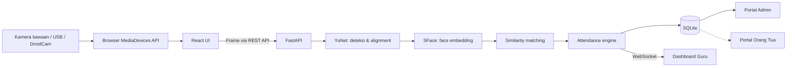
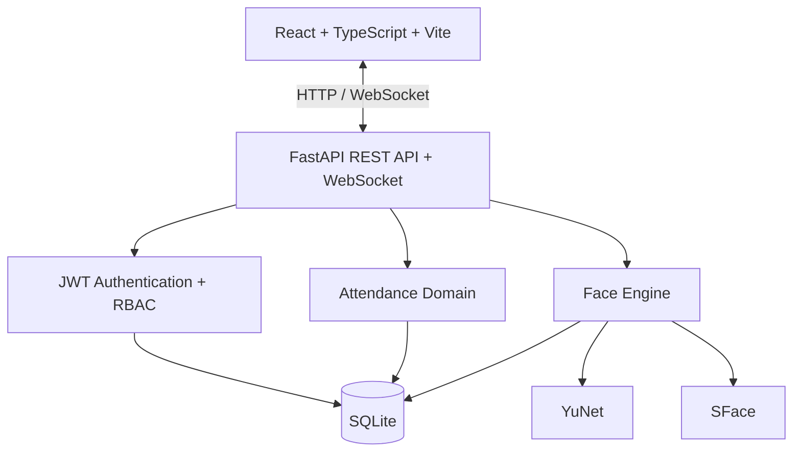

<div align="center">

# TANDARA

### Sistem Presensi Wajah untuk Sekolah

Face Recognition · Real-time Attendance · Parent–Student Linking


</div>

Tandara adalah sistem presensi sekolah berbasis pengenalan wajah. Kamera browser menangkap wajah siswa, YuNet melakukan deteksi, SFace menghasilkan dan mencocokkan embedding, lalu backend mencatat presensi yang dapat dipantau oleh Admin IT dan Guru Piket. Akun orang tua dapat ditautkan secara aman ke siswa.

> [!IMPORTANT]
> Tandara saat ini merupakan **MVP untuk development, demonstrasi, dan validasi perangkat keras**—belum dinyatakan siap untuk penggunaan produksi.

## Mengapa Tandara?

Presensi manual membutuhkan waktu dan pencatatan masuk serta pulang dapat tersebar di beberapa proses. Tandara menyatukan alur pemindaian, pencatatan, koreksi, dan pelaporan sehingga guru dapat memantau kehadiran lebih cepat, sementara akses orang tua dibatasi hanya pada siswa yang terhubung dengan akunnya.

## Fitur Utama

### Face Recognition

- Deteksi wajah dengan OpenCV YuNet dan pengenalan dengan OpenCV SFace.
- Enrollment beberapa sampel wajah per siswa.
- Validasi ukuran, ketajaman, pencahayaan, jumlah wajah, dan konsistensi sampel.
- Pencocokan berbasis cosine similarity dengan threshold yang dapat dikonfigurasi.
- Penanganan wajah tidak dikenal atau ambigu tanpa membuat identitas palsu.
- Cooldown untuk mencegah pemindaian berulang dalam waktu singkat.

### Presensi

- Sesi presensi aktif dengan mode `CHECK_IN` dan `CHECK_OUT`.
- Status kehadiran seperti `PRESENT`, `LATE`, sakit, izin, dan alpa.
- Pembaruan hasil presensi langsung melalui WebSocket.
- Riwayat, ringkasan, koreksi manual, dan ekspor CSV.
- Perlindungan terhadap pencatatan ganda pada siswa dan tanggal yang sama.

### Admin IT

- Manajemen siswa, kelas, jurusan, orang tua/wali, dan pengguna.
- Penautan orang tua/wali dengan satu atau beberapa siswa.
- Enrollment dan penghapusan data wajah siswa.
- Diagnostik backend, database, face engine, dan kamera browser.
- Audit log untuk aktivitas administratif.

### Guru Piket

- Membuka dan menutup sesi presensi.
- Pemindaian wajah dan monitoring presensi langsung.
- Riwayat kehadiran, koreksi, dan laporan CSV.
- Persetujuan atau penolakan pengajuan izin.

### Orang Tua / Wali

- Autentikasi dan profil orang tua.
- Daftar siswa yang terhubung dengan akun.
- Akses detail siswa yang dilindungi oleh relasi orang tua–siswa.
- **Dalam pengembangan:** monitoring presensi real-time dan push notification.

## Cara Kerja



DroidCam tidak berkomunikasi langsung dengan FastAPI. Aplikasi DroidCam membuat perangkat webcam virtual; browser membacanya melalui `MediaDevices`, lalu frontend mengirim frame yang dipilih ke API.

## Arsitektur



## Teknologi

| Area | Teknologi |
| --- | --- |
| Frontend | React 19, TypeScript, Vite, TanStack Query |
| Backend | Python 3.12+, FastAPI, SQLAlchemy, Pydantic |
| Database | SQLite |
| Face detection | OpenCV YuNet (ONNX) |
| Face recognition | OpenCV SFace (ONNX) |
| Authentication | JWT dan Argon2 |
| Authorization | Role-based access control (RBAC) |
| Realtime | WebSocket |
| Kamera | Browser MediaDevices API |
| Sumber kamera | Webcam bawaan, webcam USB, atau kamera virtual DroidCam |
| Local launcher | Bash untuk Ubuntu, PowerShell untuk Windows 10/11 |

Tandara tidak bergantung pada Gemini untuk deteksi atau pengenalan wajah.

## Role Pengguna

| Role | Fungsi |
| --- | --- |
| Admin IT | Mengelola data sekolah, pengguna, relasi wali, enrollment wajah, serta diagnostik sistem. |
| Guru Piket | Menjalankan sesi presensi, memantau hasil scan, mengoreksi data, menangani izin, dan membuat laporan. |
| Orang Tua / Wali | Melihat profil dan siswa yang secara eksplisit ditautkan ke akun; monitoring real-time dan notifikasi masih dikembangkan. |

## Struktur Project

```text
Tandara/
├── backend/
│   ├── app/
│   │   ├── cli/              # Inisialisasi dan utilitas data development
│   │   ├── routers/          # Endpoint FastAPI
│   │   └── services/         # Face engine dan domain service
│   ├── data/                 # Database/data wajah lokal (diabaikan Git)
│   ├── ml_models/            # Model YuNet dan SFace (diabaikan Git)
│   ├── tests/
│   └── requirements.txt
├── scripts/
│   └── tandara-windows-common.ps1
├── src/
│   ├── components/
│   ├── context/
│   ├── layouts/
│   ├── pages/
│   ├── routes/
│   ├── services/
│   ├── types/
│   └── utils/
├── prepare-demo-windows.ps1
├── setup-tandara-windows.ps1
├── start-tandara-windows.ps1
├── stop-tandara-windows.ps1
└── start-tandara.sh
```

## Quick Start

### Prasyarat model

Face engine memerlukan dua file berikut:

```text
backend/ml_models/yunet_face_detection.onnx
backend/ml_models/face_recognition_sface.onnx
```

File ONNX dan data biometrik sengaja tidak disimpan di Git. Pastikan kedua model tersedia dari paket demo/proyek yang telah disiapkan sebelum menjalankan launcher.

### Windows 10 / 11

Tandara berjalan secara native—**tanpa WSL dan tanpa Docker**. Setup memerlukan koneksi internet untuk instalasi dependency pada penggunaan pertama. Bila Python 3.12 atau Node.js belum tersedia, script dapat memasangnya melalui `winget`.

Jalankan dari PowerShell pada root project:

```powershell
powershell -ExecutionPolicy Bypass -File .\setup-tandara-windows.ps1
```

Setup akan membuat virtual environment, menginstal dependency, membuat `.env` dengan JWT secret acak bila belum ada, menginisialisasi data demo secara non-destruktif, lalu menjalankan aplikasi.

Untuk penggunaan berikutnya:

```powershell
.\start-tandara-windows.ps1
```

Opsi dan penghentian service:

```powershell
.\start-tandara-windows.ps1 -NoBrowser
.\stop-tandara-windows.ps1
```

Log tersedia di `.logs\backend.log` dan `.logs\frontend.log`.

#### Membuat paket demo Windows

Dari mesin development yang telah memiliki kedua model ONNX:

```powershell
.\prepare-demo-windows.ps1
```

Paket ZIP tidak menyertakan database, `.env`, log, dependency terinstal, atau embedding wajah lokal. Script setup pada komputer tujuan tetap membutuhkan internet untuk mengambil dependency.

### Ubuntu (development)

Prasyarat: Python 3.12+, Node.js/npm, `curl`, dan `util-linux`. Siapkan environment satu kali:

```bash
python3.12 -m venv .venv
.venv/bin/pip install -r backend/requirements.txt
npm ci
cp .env.example .env
```

Ganti `SECRET_KEY` pada `.env` dengan nilai acak yang kuat. Untuk data demo development yang idempotent:

```bash
APP_ENV=development PYTHONPATH=backend .venv/bin/python -m app.cli.init_demo
```

Kemudian jalankan seluruh stack:

```bash
chmod +x start-tandara.sh
./start-tandara.sh
```

Perintah lain yang tersedia:

```bash
./start-tandara.sh --no-browser
./start-tandara.sh --status
```

Tekan `Ctrl+C` untuk menghentikan service yang dibuat launcher.

### URL lokal

| Layanan | URL |
| --- | --- |
| Web app | <http://localhost:3000> |
| Backend API | <http://127.0.0.1:8000> |
| API documentation | <http://127.0.0.1:8000/docs> |
| Health diagnostics | <http://127.0.0.1:8000/api/health> |

### Akun demo development

Inisialisasi demo membuat akun berikut hanya saat `APP_ENV=development`:

| Role | Username | Password |
| --- | --- | --- |
| Admin IT | `admin` | `Admin123!` |
| Guru Piket | `guru` | `Guru123!` |

Seed bersifat idempotent, menyimpan password sebagai hash Argon2, dan tidak menimpa akun yang telah ada. Akun default ini tidak dibuat otomatis pada production dan wajib diganti atau dihapus di luar kebutuhan demo lokal.

## Kamera dan DroidCam

Webcam bawaan atau USB dapat langsung dipilih dari browser. Untuk menggunakan kamera ponsel melalui DroidCam:

1. Instal aplikasi ponsel serta client/driver DroidCam dari sumber resminya.
2. Hubungkan ponsel ke komputer; USB lebih stabil untuk demonstrasi bila tersedia.
3. Jalankan DroidCam hingga perangkat muncul sebagai webcam virtual di sistem operasi.
4. Buka Tandara dan izinkan akses kamera pada browser.
5. Pilih perangkat DroidCam pada pemilih kamera, lalu periksa preview sebelum memulai scan.

Jika kamera tidak muncul, tutup aplikasi lain yang sedang menggunakannya, periksa izin kamera browser/OS, lalu muat ulang halaman. Di Ubuntu, pastikan perangkat terlihat sebagai `/dev/video*`.

## Konfigurasi

Konfigurasi utama berada di `.env`; gunakan `.env.example` sebagai dasar. Beberapa nilai penting:

| Variabel | Kegunaan |
| --- | --- |
| `SECRET_KEY` | Kunci penandatanganan JWT; gunakan nilai acak yang kuat. |
| `APP_ENV` | Environment aplikasi, misalnya `development` atau `production`. |
| `DATABASE_URL` | Lokasi database SQLite. |
| `VITE_API_URL` | Base URL API yang dipakai frontend. |
| `VITE_SCAN_INTERVAL_MS` | Interval pengiriman frame dari UI presensi. |

Threshold face engine memiliki nilai awal untuk MVP dan **bukan hasil kalibrasi dataset sekolah**. Evaluasi false accept/false reject dengan data lokal sebelum pemakaian operasional.

## Pengujian

```bash
cd backend
../.venv/bin/pytest
cd ..
npm run lint
npm run build
git diff --check
```

Suite backend saat README ini diperbarui berisi 65 test untuk domain, autentikasi, parent linking, enrollment, face recognition, presensi, seed demo, dan diagnostik sistem.

## Keamanan dan Privasi

- Password disimpan sebagai hash Argon2 dan autentikasi API menggunakan JWT.
- Endpoint dilindungi RBAC untuk `ADMIN_IT`, `GURU_PIKET`, dan `PARENT`.
- Akun orang tua hanya dapat mengakses siswa yang telah ditautkan kepadanya.
- Database, `.env`, log, model ONNX, dan data wajah lokal diabaikan oleh Git.
- Launcher mengikat backend ke `127.0.0.1` untuk penggunaan lokal.
- SQLite dan data wajah lokal pada MVP belum dienkripsi at rest.

Embedding dan citra wajah merupakan data biometrik sensitif. Penggunaan nyata memerlukan persetujuan yang sah, kebijakan retensi/penghapusan, pembatasan akses, backup yang aman, kalibrasi, serta tinjauan keamanan dan regulasi yang berlaku.

## Status dan Roadmap

Tandara saat ini berfokus pada demonstrasi end-to-end lokal: pengelolaan data sekolah, enrollment wajah, sesi presensi, monitoring guru, laporan, parent–student linking, dan diagnostik sistem.

Tahap berikutnya:

- [ ] Monitoring presensi real-time untuk orang tua.
- [ ] Push notification kepada orang tua/wali.
- [ ] Kalibrasi threshold menggunakan data representatif dan protokol evaluasi yang terdokumentasi.
- [ ] Enkripsi data sensitif, hardening, observability, serta strategi backup/restore untuk deployment non-demo.
- [ ] Validasi lintas perangkat kamera dan pengujian operasional di lingkungan sekolah yang berizin.

## Catatan Pengembangan

- Jangan commit `.env`, database lokal, log, citra, atau embedding wajah.
- Gunakan data yang telah mendapat izin untuk enrollment dan pengujian.
- Perubahan skema atau alur autentikasi harus mempertahankan pembatasan role dan parent–student access.
- Proyek belum memiliki lisensi open-source; jangan menganggap kode boleh didistribusikan ulang sampai lisensi ditambahkan oleh pemilik proyek.
